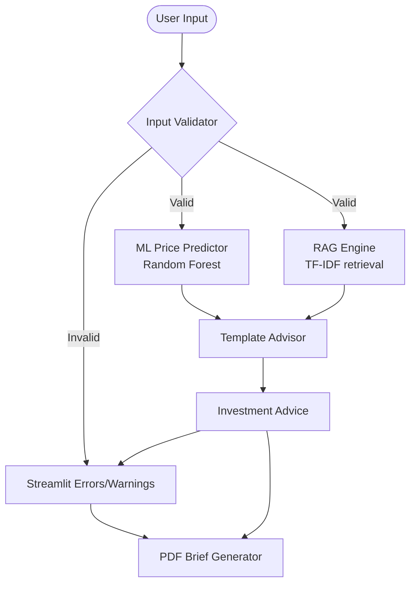

# Intelligent Property Valuation Agentic Advisor 🏠

A high-performance hybrid AI/ML platform for real estate valuation. It pairs a deterministic Random Forest regressor with a stochastic Retrieval-Augmented Generation (RAG) engine to provide not just a price, but a grounded investment narrative.

## 🔗 Live Demo
**Access the application on Streamlit Cloud:** [Live Demo](https://property-valuation-agentic-advisor-xvfy6pzq5caq72fmxlzrak.streamlit.app/)

> [!NOTE]
> The hosted deployment is monitored via `/healthz`. If the root app URL redirects through `share.streamlit.io/-/auth/app`, the app is alive but Streamlit Cloud visibility is still restricted for anonymous visitors.

## 📐 System Architecture
The system follows a **deterministic workflow** where ML predictions are enriched by a local knowledge base (retrieval) and summarized by a template-based advisor (no LLM dependencies).



### Core Components
- **Deterministic Brain (ML)**: A Random Forest model trained on historical housing data to provide baseline valuations.
- **Contextual Memory (RAG)**: A lightweight retrieval index over the local knowledge base that surfaces market trends and relevant notes.
- **Advisory Layer**: A template-based advisor that combines the ML estimate, retrieved context, and comparable sales.
- **Presentation Layer**: A professional Streamlit UI with PDF export capabilities for institutional-grade briefs.

## 🎯 Demo Guidance

### 1. The "Happy Path" (Standard Valuation)
- **Inputs**: 2500 sq ft, 3 Bedrooms, 2 Bathrooms, 2 Stories, Main Road: Yes, Parking: 2.
- **Expectation**: A realistic price estimate (~₹60L - ₹80L) and a professional AI breakdown of the property's investment potential.
- **Action**: Click "Download Investment Report (PDF)" to see the full brief.

### 2. The "Guardrail Path" (Outlier Detection)
- **Inputs**: 5000 sq ft, 1 Bedroom.
- **Expectation**: The `validator.py` will trigger a **Soft Warning** (Unusual area for bedrooms).
- **Benefit**: Demonstrates the system's ability to prevent "Garbage In, Garbage Out" scenarios.

### 3. The "Deterministic Path" (No API Key Needed)
- **Action**: Run the app without any LLM/API keys.
- **Expectation**: The app always generates an advisory summary using deterministic retrieval + simple decision rules.

## 📊 Model & Metrics
The model is trained on the [Kaggle Housing dataset](https://www.kaggle.com/datasets/yasserh/housing-prices-dataset) (546 records).

| Metric | Random Forest | Linear Regression |
| :--- | :--- | :--- |
| **R² Score** | 0.582 | 0.627 |
| **MAE** | ₹1,080,958 | ₹999,836 |

> [!NOTE]
> While Linear Regression has a slightly higher R², Random Forest is chosen for the production "Advisor" path for its ability to capture non-linear feature interactions and provide **Feature Importance** insights.

## 🛠️ Installation & Setup

### Local Setup
```bash
git clone https://github.com/NssGourav/property-valuation-agentic-advisor.git
cd property-valuation-agentic-advisor
python3 -m venv venv
source venv/bin/activate
pip install -r requirements.txt
pip install -r requirements-dev.txt 
```

### 2. Train the Model Locally
If `models/house_model.pkl` is missing, train the model:
```bash
python3 src/train_model.py
```
`models/house_model.pkl` is treated as a build artifact and is not committed to git.

### 3. Run the App
```bash
streamlit run src/app.py
```

### Environment Configuration
| Variable | Description |
| :--- | :--- |
| `KAGGLE_USERNAME` | Required if retraining the model from source. |

### Running Tests
```bash
python3 -m pytest tests/
```

### Deployment Smoke Check
```bash
bash scripts/check_streamlit_deployment.sh
```

What it verifies:
- `APP_URL/healthz` responds with `{"status":"ok"}`
- the root URL is checked for a Streamlit auth redirect, which indicates the deployment is running but not publicly accessible yet

## 📂 Project Structure
- `src/app.py`: Streamlit frontend.
- `src/agent.py`: Template-based advisor (no LLM dependencies).
- `src/rag_engine.py`: Knowledge-base retrieval + comparable-sales matcher.
- `src/train_model.py`: ML pipeline (download -> preprocess -> tuning -> evaluation).
- `src/validator.py`: Input guardrails.
- `src/pdf_report.py`: Automated PDF reporting via ReportLab.

## 🛡️ Limitations & Roadmap
- **Current**: Static knowledge base in `comparable_sales.txt`.
- **Roadmap**: 
  - [ ] **Live Market Data**: Integration with real estate APIs for real-time comps.
  - [ ] **Interactive Maps**: Geographic visualization of target property vs. retrieved comps.
  - [ ] **Deep Learning**: Experimenting with XGBoost or Neural Networks for improved R².

## 👥 Team
- **Nss Gourav**
- **Subham Sangwan**

---
*Developed for Project 9: Intelligent Property Price Prediction.*
